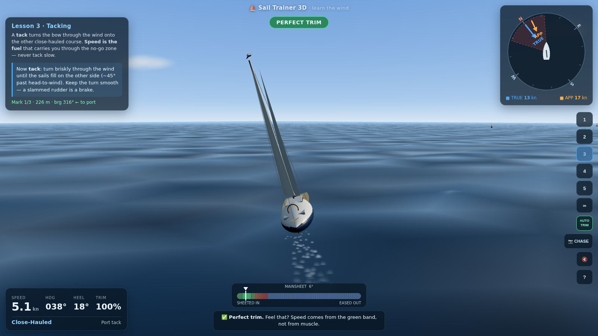

# ⛵ Sail Trainer 3D

A 3D yacht-sailing simulator that teaches you **how wind really works** — apparent
wind, sail trim, the no-go zone, tacking and gybing — through a guided, hands-on
curriculum on open water.

 



## Play

Any static file server works (ES modules can't load from `file://`):

```bash
# from the repo root — pick one:
python3 -m http.server 8000
npx serve .
```

Then open <http://localhost:8000>. No build step, no external network — Three.js
is vendored in `vendor/`.

## What you'll learn

| Lesson | Skill |
|---|---|
| 1 · Feel the Wind | Reading the wind rose, sheeting in until the sail fills, beam reaching |
| 2 · The No-Go Zone | Why you can't sail straight upwind; getting out of irons; close-hauled |
| 3 · Tacking | Turning the bow through the wind with speed; beating upwind; COLREGs Rule 12 |
| 4 · Downwind & the Gybe | Broad reaching, running, controlled gybes, "by the lee" danger |
| 5 · Round the Course | A timed triangle regatta — beat, reach, run |
| ∞ · Free Sail | Open water with live wind controls, gusts and shifts — plus an AI yacht for practicing COLREGs Rule 12 right-of-way |

## Controls

| Key | Action |
|---|---|
| `A`/`D` or `←`/`→` | Rudder |
| `W`/`S` or `↑`/`↓` | Sheet in / ease out |
| `T` | Auto-trim assist |
| `C` | Camera: chase · helm · tactical top-down |
| `P` | Points-of-sail diagram |
| `1`–`6` | Select lesson |
| `M` | Sound |
| `H` | Help |
| drag / wheel | Orbit / zoom (chase camera) |

## The physics (short version)

Everything the HUD shows is computed from a real (simplified) sailing model,
documented in [`docs/RESEARCH.md`](docs/RESEARCH.md):

- **Apparent wind** = true wind − boat velocity, recomputed every frame; sails
  respond to *apparent*, not true wind.
- The sail is an **airfoil**: an angle-of-attack curve gives luffing below ~5°,
  peak lift near 20°, stall beyond ~35°, parachute-drag mode toward 90°.
- Sail force splits into **drive** (`F·sin(boom)`) and **side force**
  (`F·cos(boom)`) — which is why close-hauled boats heel hard and running boats
  stand upright, and why the **no-go zone** emerges naturally from the math.
- Rudder authority scales with water flow: no speed, no steering — and reversed
  steering when drifting backwards in irons.
- Weather helm, leeway, windage, gusts and wind shifts are all in there.

## Project layout

```
index.html        UI shell + HUD DOM
styles.css        HUD styling
src/main.js       renderer, cameras, input, audio, game loop
src/physics.js    wind + yacht dynamics (the model)
src/boat.js       procedural yacht, wind-shaped cloth sails, wake
src/ocean.js      water/sky shaders, buoys
src/hud.js        wind rose, trim gauge, instruments, coach tips
src/lessons.js    the six-lesson curriculum
docs/RESEARCH.md  nautical rules & physics research behind the model
vendor/           three.js (vendored, offline-friendly)
```
